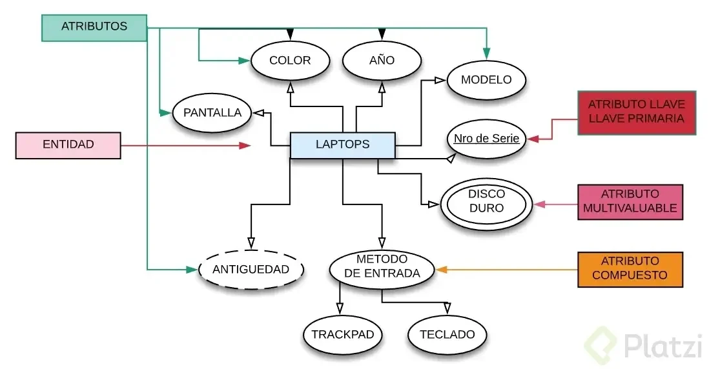
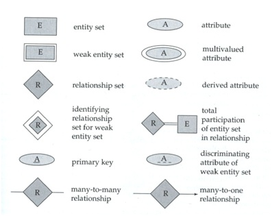
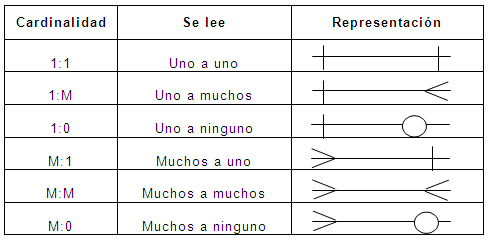

# Fundamentos de Bases de Datos

[13 Reglas de Codd](./Reglas_Codd.md)

## Entidades

Una entidad es algo similar a un objeto (programación orientada a objetos) y representa algo en el mundo real, incluso algo abstracto. Tienen atributos que son las cosas que los hacen ser una entidad y por convención se ponen en plural.

### Atributos

Son las características o propiedades que describen a la entidad (se encierra en un óvalo). Los atributos se componen de:

- Los atributos compuestos son aquellos que tienen atributos ellos mismos.

- Los atributos llave son aquellos que identifican a la entidad y no pueden ser repetidos. Existen:

  - Naturales: son inherentes al objeto como el número de serie
  - Clave artificial: no es inherente al objeto y se asigna de manera arbitraria.

### Tipos de Entidades

Entidades fuertes: son entidades que pueden sobrevivir por sí solas.

Entidades débiles: no pueden existir sin una entidad fuerte y se representan con un cuadrado con doble línea.

- Identidades débiles por identidad: no se diferencian entre sí más que por la clave de su identidad fuerte.

- Identidades débiles por existencia: se les asigna una clave propia.

### Representación

## Relaciones

Las relaciones nos permiten ligar o unir nuestras diferentes entidades y se representan con rombos. Por convención se definen a través de verbos.

Las relaciones tienen una propiedad llamada cardinalidad y tiene que ver con números. Cuántos de un lado pertenecen a cuántos del otro lado:

- Cardinalidad: 1 a 1
- Cardinalidad: 0 a 1
- Cardinalidad: 1 a M
- Cardinalidad: 0 a M
- Cardinalidad: M a M

