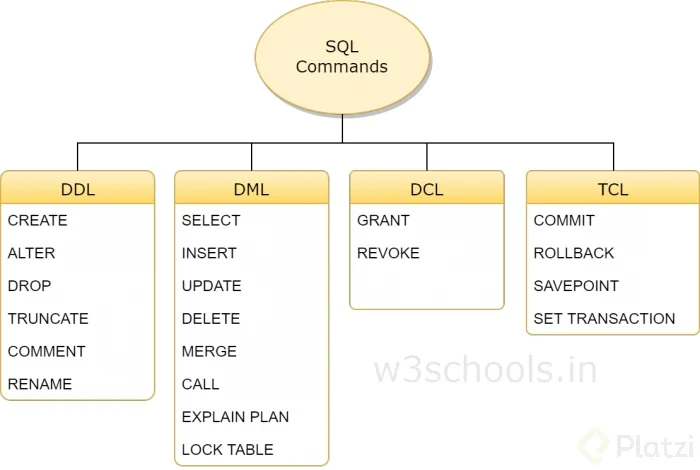

# Fundamentos de Bases de Datos

[13 Reglas de Codd](./Reglas_Codd.md)

## Entidades

Una entidad es algo similar a un objeto (programación orientada a objetos) y representa algo en el mundo real, incluso algo abstracto. Tienen atributos que son las cosas que los hacen ser una entidad y por convención se ponen en plural.


### Atributos

Son las características o propiedades que describen a la entidad (se encierra en un óvalo). Los atributos se componen de:

- Los atributos compuestos son aquellos que tienen atributos ellos mismos.

- Los atributos llave son aquellos que identifican a la entidad y no pueden ser repetidos. Existen:

  - Naturales: son inherentes al objeto como el número de serie
  - Clave artificial: no es inherente al objeto y se asigna de manera arbitraria.

### Tipos de Entidades

Entidades fuertes: son entidades que pueden sobrevivir por sí solas.

Entidades débiles: no pueden existir sin una entidad fuerte y se representan con un cuadrado con doble línea.

- Identidades débiles por identidad: no se diferencian entre sí más que por la clave de su identidad fuerte.

- Identidades débiles por existencia: se les asigna una clave propia.

### Representación


## Relaciones

Las relaciones nos permiten ligar o unir nuestras diferentes entidades y se representan con rombos. Por convención se definen a través de verbos.

Las relaciones tienen una propiedad llamada cardinalidad y tiene que ver con números. Cuántos de un lado pertenecen a cuántos del otro lado:

- Cardinalidad: 1 a 1
- Cardinalidad: 0 a 1
- Cardinalidad: 1 a N
- Cardinalidad: 0 a N
- Cardinalidad: N a N


## Tipos de Datos

|Texto  | Números | Fecha/Hora|Lógicos|
|-------|---------|-----------|----|
|CHAR (n)| INTEGER  |DATE| BOOLEAN|
|VARCHAR (n)| BIGINT | TIME||
|TEXT| DECIMAL (n,s)| DATETIME||
||NUMERIC (n,s)| TIMESTAMP||
||SMALLINT|||

## Restricciones

|Tipo de Restricción | Descripción |
|----|----------|
|NOT NULL| Se asegura que la columna no tenga valores nulos|
|UNIQUE| Se asegura que cada valor en la columna no se repita|
|PRIMARY KEY| Es una combinación de NOT NULL y UNIQUE|
|FOREIGN KEY| Identifica de manera única una tupla en otra tabla|
|CHECK| Se asegura que el valor en la columna cumpla una condición dada|
|DEFAULT| Coloca un valor por defecto cuando no hay un valor especificado|
|INDEX| Se crea por columna para permitir búsquedas más rápidas|

## Normalización

### Primera forma normal (1FN)

Formalmente, una tabla está en primera forma normal si:

- Todos los atributos son atómicos. Un atributo es atómico si los elementos del dominio son simples e indivisibles.
- No debe existir variación en el número de columnas.
- Los campos no clave deben identificarse por la clave (dependencia funcional).
- Debe existir una independencia del orden tanto de las filas como de las columnas; es decir, si los datos cambian de orden no deben cambiar sus significados.

Se traduce básicamente a que si tenemos campos compuestos como por ejemplo “nombre_completo” que en realidad contiene varios datos distintos, en este caso podría ser “nombre”, “apellido_paterno”, “apellido_materno”, etc.

También debemos asegurarnos que las columnas son las mismas para todos los registros, que no haya registros con columnas de más o de menos.

Todos los campos que no se consideran clave deben depender de manera única por el o los campos que si son clave.

Los campos deben ser tales que si reordenamos los registros o reordenamos las columnas, cada dato no pierda el significado.


Atributos atómicos (Sin campos repetidos)


### Segunda forma normal (2FN)

Formalmente, una tabla está en segunda forma normal si:

- Está en 1FN
- Sí los atributos que no forman parte de ninguna clave dependen de forma completa de la clave principal. Es decir, que no existen dependencias parciales.
- Todos los atributos que no son clave principal deben depender únicamente de la clave principal.

Lo anterior quiere decir que sí tenemos datos que pertenecen a diversas entidades, cada entidad debe tener un campo clave separado

Cumple 1FN y Cada campo de la tabla debe depender de una clave única.


### Tercera forma normal (3FN)

Esta FN se traduce en que aquellos datos que no pertenecen a la entidad deben tener una independencia de las demás y debe tener un campo clave propio. Continuando con el ejemplo anterior, al aplicar la 3FN

Cumple 1FN y 2FN y los campos que NO son clave NO deben tener dependencias.


### Cuarta forma normal (4FN)

Esta FN trata de eliminar registros duplicados en una entidad, es decir que cada registro tenga un contenido único y de necesitar repetir la data en los resultados se realiza a través de claves foráneas.

Cumple 1FN, 2FN y 3FN los campos multievaluados se identifican por una clave única.


## SQL hasta la sopa

Diferentes sublenguajes del lenguaje SQL


### Sublenguaje DDL

**Creación de bases de datos y tablas** (CREATE).

``` SQL
#Crear una base de datos
CREATE DATABASE test_db;
USER DATABASE test_db;

#Crear una tabla
CREATE TABLE people(
  person_id INTEGER PRIMARY KEY AUTOINCREMENT NOT NULL,
  last_name VARCHAR(255),
  first_name VARCHAR(255),
  address VARCHAR(255),
  city VARCHAR(255)
);
```

En este caso lo primero que estamos haciendo es crear la base de datos llamada test_db y seleccionándola.

Lo siguiente a realizar es crear la tabla people cuyo campo llave es *person_id* en el cual lo llamamos clave primaria que sea autoincremental es decir que vaya aumentando en cada registro y que no se permita que este campo se encentré vació.

Los siguientes campos son en su gran mayoría texto a 255 Caracteres.

**Creando una vista** (SELECT)

```SQL
# Crear View
CREATE OR REPLACE VIEW v_brasil_customers AS 
  SELECT customer_name,
  contact_name
  FROM customers
  WHERE country = "Brasil";
```

En este código empieza checando si ya existe la vista *v_brasil_customers* en caso de que no, lo crea seleccionando los campos de *[ customer_name, contact_name]* de la tabla customers donde el país de residencia sea brasil.

**Modificar una tabla** (ALTER)

```SQL
ALTER TABLE people
ADD date_of_birth DATE;

ALTER TABLE people
ALTER COLUMN date_of_birth YEAR;

ALTER TABLE people
DROP COLUMN date_of_birth;
```

Lo primero a realizar es tomar la tabla people y le añadimos el campo de *date_of_birth* el cual especificamos que sea de tipo fecha.

En la segunda modificación cambiamos el campo antes mencionado a un que solo almacene el año.

Y por ultimo eliminamos el cambio de la tabla people.
