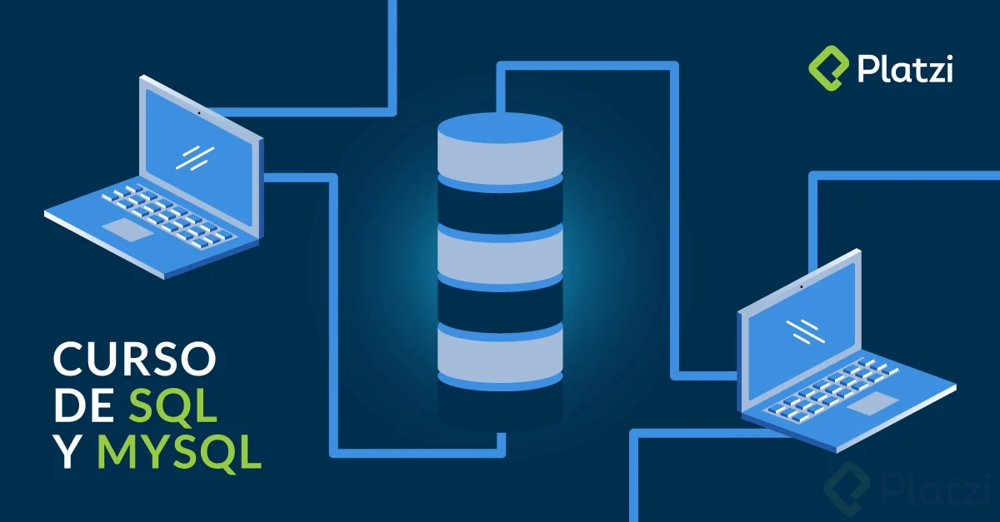

# Copilado de Bases de Datos

Repositorio donde se quedara recopilado las, notas e información de los diferentes cursos de Base de Datos de Platzi para Data Science y Data Engineer.

Algunos de los cursos van enfocados al manejo de datos y otros a los fundamentos de bases de datos los cursos que se verán son:

- [Fundamentos de Bases de Datos](./Fundamentos_BD/README.md)
- PostgreSQL.
- Curso Practico SQL.
- PostgreSQL Aplicado a Ciencia de Datos.
- Herramientas de Inteligencia Artificial para Equipos de Datos.

Con esto se espera que logre manejar las bases de datos y hacer consultas SQL de manera practica.

